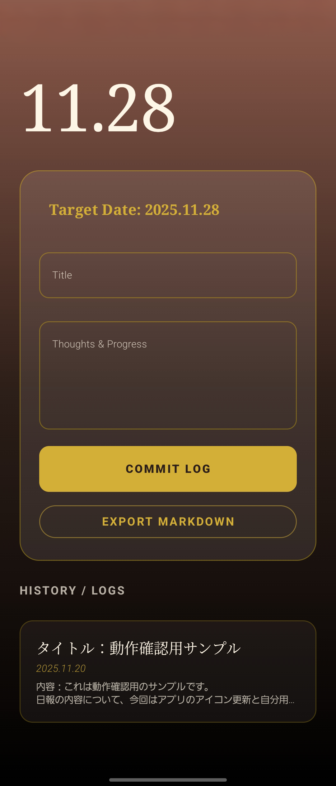
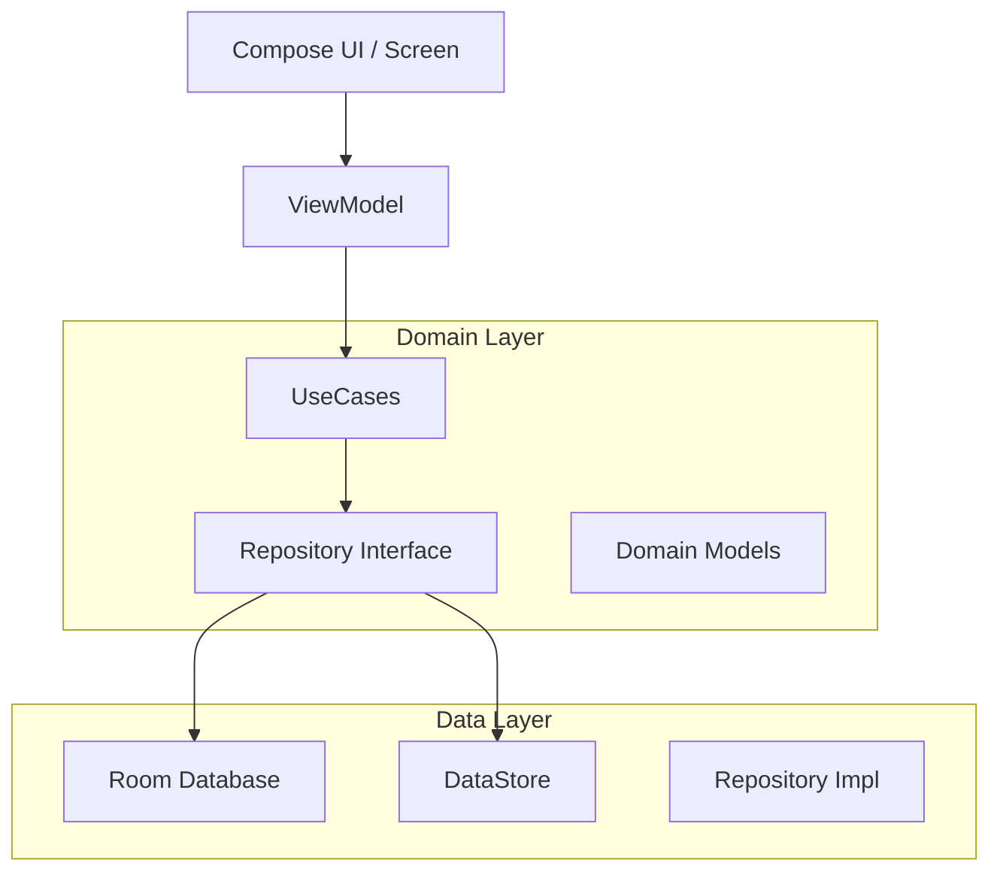

# 🌇 DailySync: Sunset Lounge Edition

> **"Reflect on your day in the warmth of the sunset."**

夕暮れのラウンジをイメージした **「Sunset Lounge (Warm Luxury Glass)」** デザインの、エンジニア向け日報 & ジャーナリングアプリ。

## 🚀 概要 (Overview)

DailySync は、日々の作業内容や学びを **「情緒的かつ効率的」** に記録するためのアプリケーションです。

v1.0 の大規模アップデートにより、インメモリ実装から Room Database + Hilt による本格的なアーキテクチャへ移行しました。

デザイン面では、姉妹アプリである BugMemo の「Iceberg Tech（寒色）」と対をなす、「Sunset Lounge（暖色）」テーマを採用し、書くこと自体が楽しくなる UI を目指しています。

---

## アプリ画面(新旧)

<table>
<tr>
<td align="center">

<br>
<sub>(新)ホーム</sub>
</td>
<td align="center">

<br>
<sub>(旧)ホーム</sub>
</td>
</tr>
</table>

---

## ✨ 主な機能 (Features)

### ✍️ Writing Experience

#### Immersive Editor

- ステータスバーを透過した Edge-to-Edge の没入型エディタ
- エディトリアルデザイン（雑誌のようなレイアウト）を意識したタイポグラフィ

#### Smart Copy

昨日の日報をワンタップで参照・コピーする機能。日付などは自動で「今日」のものに置換されます。

#### Preview Mode

入力中の Markdown（太字、リンク、リスト）を即座にレンダリングして確認できるプレビュー機能。

### ⚙️ Smart Integration

#### Issue Tracker Link

設定画面でベース URL（GitHub/Jira 等）を登録することで、`#123`などのチケット番号を自動的にリンク化。

#### Markdown Export

作成した日報を Markdown 形式で整形し、Slack や GitHub Gist などの外部アプリへ即座に共有。

## 🎨 Design System: "Sunset Lounge"

**Concept**: 高級ホテルのラウンジ、夕暮れ、琥珀色。

### Visuals

- `LuxuryCopper` ~ `LuxuryDeepBrown` の暖色グラデーション
- 磨りガラスのようなカード UI (GlassMorphism)
- セリフ体とサンセリフ体を組み合わせた優雅なフォント使い

## 🛠️ 技術スタック (Tech Stack)

### Architecture

MVVM + Clean Architecture を採用し、責務を明確に分離しています。



#### UseCases

`CreateDailyReport`, `GetLastDailyReport` など、ユーザーの操作単位でロジックをカプセル化。

#### DI (Hilt)

`AppModule`により、DB や Repository、UseCase の依存関係を一元管理。

### Libraries

- **UI**: Jetpack Compose (Material 3), Navigation Compose
- **Async**: Kotlin Coroutines, Flow / StateFlow
- **Database**: Room (KSP, Migration 対応), DataStore (Preferences)
- **Build**: Gradle Kotlin DSL + Version Catalog (libs.versions.toml)
- **Quality**: Spotless (Ktlint), GitHub Actions

## 💻 セットアップ

### ビルドコマンド

```bash
# 依存解決
./gradlew help

# ビルド & インストール
./gradlew installDebug

# コード整形
./gradlew spotlessApply

# テスト
./gradlew test
```

### 開発環境

- JDK 17
- Android Studio Ladybug 以降

## 📂 プロジェクト構成

- **presentation/**: UI (Screen, ViewModel, Components)
- **domain/**: ビジネスロジック (UseCase, Model, Repository Interface)
- **data/**: データ実装 (Room Entity/Dao, Repository Impl, DataStore)
- **di/**: Hilt Modules

---

_DailySync - Reflect on your day in the warmth of the sunset._
